<div align="center">

<!-- HEADER -->


<a href="https://git.io/typing-svg">
  
</a>

<br/>


&nbsp;

&nbsp;


</div>

---

<div align="center">

</div>

<table border="0" align="center" cellpadding="0" cellspacing="0" width="780">
<tr>

```yaml
# mohammednaveen.yml

name     : Mohammed Naveen P A
alias    : @mohammednaveen
domain   : AI · ML · Data Science
outside  : Composed frame, heavy hands.
status   : Navigating the ML landscape
collab   : open ✓
```

</td>
</tr>
</table>

---

<div align="center">


<br/>

**Languages & Core**


**AI · Data Science**


**Tooling & Foundations**


</div>

---

<div align="center">


<br/>

<!-- 
&nbsp;
 -->

<br/>


<br/>

<!--  -->

</div>

---

<div align="center">


<br/>



<sub><i>Mind , body , models &nbsp;·&nbsp; the discipline remains: train without compromise &nbsp;</i></sub>

</div>

---

<div align="center">


<br/>

<a href="https://www.linkedin.com/in/mohammednaveen4250/" target="_blank">
  
</a>
&nbsp;
<a href="https://x.com/mohammednaveen_" target="_blank">
  
</a>
&nbsp;
<a href="https://github.com/mohammednaveen" target="_blank">
  
</a>

<br/><br/>

<sub><b>Got an idea? A dataset? A problem worth solving?</b><br/>I'm always open to interesting collaborations — reach out.</sub>

</div>

<!-- <br/> -->


